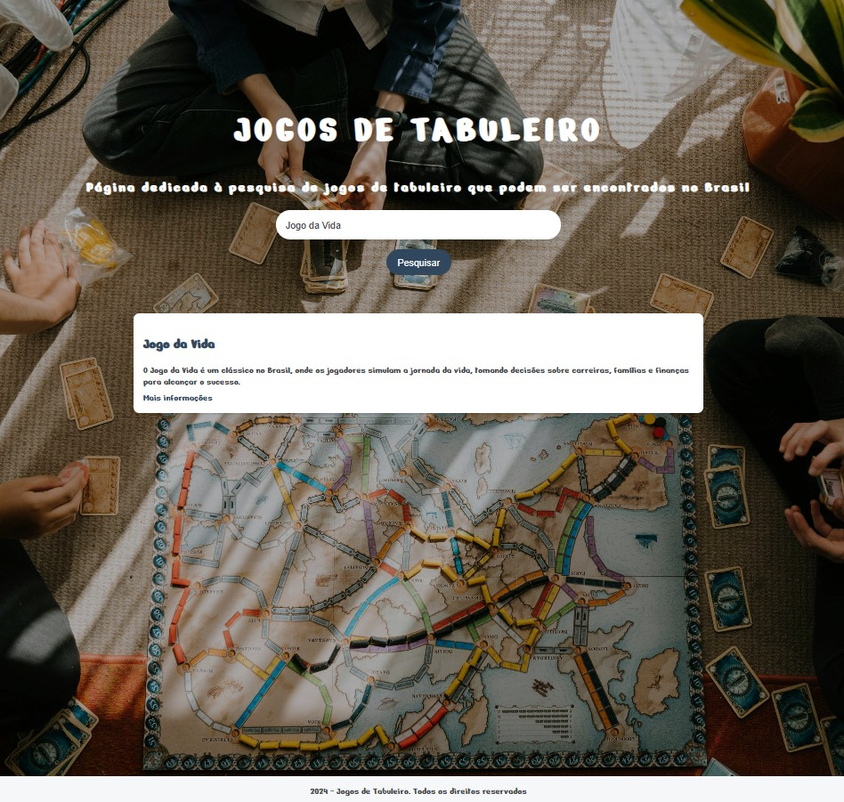

# 🎲 Board Games Wiki

This project is a simple web page dedicated to searching for board games available in Brazil. It allows users to search for games by title or description, displaying results with links to more information.
The project was developed during "Imersão Dev Alura com IA", in partnership with Google Gemini, as a practical exercise to learn how to build web applications using AI prompts to support the development process.

## 🛠️ Technologies Used
- **HTML**: Web page structure.
- **CSS**: Styling and responsive layout.
- **JavaScript**: Search logic and DOM manipulation.
- **Google Gemini**: Support in creating the project and the code.

## 👀 How to View
1. Download or clone the repository.
2. Open the `index.html` file in any modern web browser.
3. Type the name of a game in the search field.
4. Click “Pesquisar” to see the results.

## 🖼️ Assets and Credits
- **Images**: [Pexels - Board Game Background](https://www.pexels.com/photo/4691555/)
- **Font**: "Nerko One" (Google Fonts)
- **Ludopedia and Wikipédia**: Sources of information about the listed games.
- **Created by**: Gabriela Spanemberg Bado

## 📄 License
This project is for educational purposes only.

## 🖥️ Preview

> Example of the project interface.
